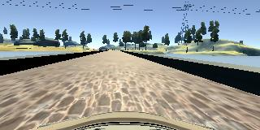
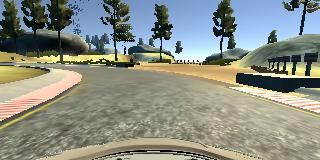

# **Behavioral Cloning Project**

---
### Submitted Files

My project includes the following files:
* model.py containing the script to create and train the model
* drive.py for driving the car in autonomous mode at speed 15
* model.h5 containing a trained convolution neural network
* writeup_report.md summarizing the results

### Model Architecture and Training Strategy

#### 1. Model Architecture

For preprocessing, every input image is normalized to range between -0.5 and 0.5 and cropped to remove irrelevant parts.

The main network is similar to LeNet. It consists of two convolution layers with 12 channel 5x5 filter and 6 channel 5x5 filter respectively (model.py lines 77-79). A RELU activation and a max pooling layer follow each convolution layer.

The model uses two hidden dense layer and one output dense layer with RELU activation to predict the steering output.

#### 2. Attempts to reduce overfitting

20 percent of the collected data is used for validation. When overfitting is observed, I simply record more training data. Also, since the training does not take more than 2 minutes, I manually tune the number of training epoch to avoid overfitting.

#### 3. Model parameter tuning

The model used an adam optimizer with learning rate 1e-3.

#### 4. Training data collection and data augmentation

In total, I collected three laps of smooth driving in the center of the lane, three extra rounds of wiggly crossing the bridge (see image blow),

and ten rounds of turning left at the corner where the side mark is missing after the bridge (see image below).

The reason to record extra data is explained in the next section.

For data augmentation, I flip the input image horizontally and invert the steering output.

### Training process

My first attempt only uses the smooth center driving laps data. The initial model can control the car through the first and second left turn but get stuck around the bridge. I suppose this is because I mostly go straight around the bridge so the model can not learn to correct its position. The extra data on the bridge is recorded with intensional deviation and correction of steering from the center. With the extra data, my model can cross the bridge robustly.

However, it fails to make a sharp turn after the bridge. Therefore, I collect more data around this corner and the model did learn to make a sharp turn as shown in the submitted video.
